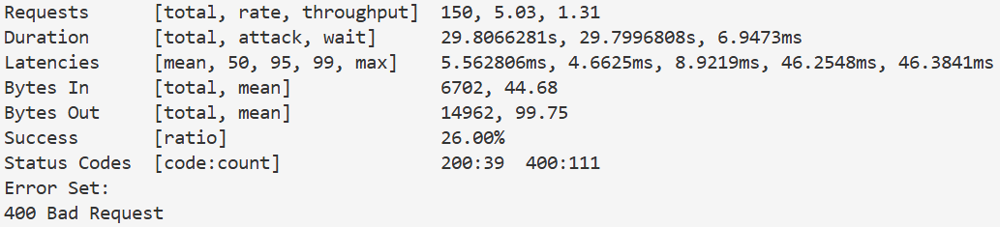

# Pull Request Service 🎯

## О проекте
Сервис предназначен для автоматического назначения ревьюеров для Pull Request'ов. Реализован на **Go** (1.25.1) с использованием фреймворка **Gin**. В качестве базы данных используется 2 варианта: **PostgreSQL** (по умолчанию) или in-memory хранилище на основе обычной структуры map. Для миграций используется **Liquibase**

## 🚀 Быстрый старт
### Предварительные требования
- Go 1.25+
- Docker & Docker Compose (для поднятия контейнеров)
- golangci-lint (для запуска линтеров)
- make (для запуска Makefile)

### Установка и запуск
1. Склонируйте репозиторий
    ```bash
    # Клонирование репозитория
    git clone git@github.com:salex06/pr-service.git
    # Переход в корневую директорию проекта
    cd pr-service
    ```
**UPDATED!** В целях проверки тестового задания внесены изменения в следующие шаги

2. Теперь в репозитории уже лежит .env-файл с заданными значениями:
    ```bash
    # Название контейнера
    POSTGRES_CONTAINER = postgres

    # Порт в network (для общения с другими контейнерами) 
    POSTGRES_CONTAINER_PORT=5432 

    # Данные для авторизации в Postgres
    POSTGRES_USER=pr-service-admin 
    POSTGRES_PASSWORD=svc-123_pr
    POSTGRES_DB=postgres

    # Порт, на котором поднимается сервер pr-service
    SERVER_PORT=8080 
    ```
3. Для запуска приложения достаточно ввести команду
    ```bash
    docker-compose up
    ```
<!-- 2. (**ВАЖНО!**) Создайте файл *.env* в корне проекта на основе файла *.env.example* и запишите туда конфигурацию базы данных и приложения 
    ```bash
    POSTGRES_CONTAINER = <container_name> 
    POSTGRES_CONTAINER_PORT=<container_port>
    POSTGRES_USER=<your-user>
    POSTGRES_PASSWORD=<your-password>
    POSTGRES_DB=<your-db>

    SERVER_PORT=8080
    ```
3. Запустите контейнеры
    ```bash
    docker-compose up --build -d
    # ИЛИ с помощью Makefile
    make full-setup #(quick-setup чтобы пропустить линтеры и форматирование) 
    ```
4. Сервис запущен! Для остановки сервиса выполните команды:
    ```bash
    docker-compose down
    # ИЛИ с помощью Makefile
    make compose-down
    ``` -->

## 📚 API Документация
### Основные эндпоинты

| Метод | Путь | Описание |
|-------|------|----------|
| `POST` | `/team/add` | Создать команду с участниками (создает/обновляет пользователей) |
| `GET` | `/team/get` | Получить команду с участниками |
| `POST` | `/users/setIsActive` | Установить флаг активности пользователя |
| `GET` | `/users/getReview` | Получить PR'ы, где пользователь назначен ревьюером |
| `POST` | `/pullRequest/create` | Создать PR и автоматически назначить до 2 ревьюеров из команды автора |
| `POST` | `/pullRequest/merge` | Пометить RP как MERGED (идемпотентная операция) |
| `POST` | `/pullRequest/reassign` | Переназначить конкретного ревьюера на другого из его команды |

### Дополнительные эндпоинты

| Метод | Путь | Описание |
|-------|------|----------|
| `POST` | `/team/deactivateAll` | Перевести всех участников заданной команды в неактивное состояние |
| `GET` | `/stats` | Получить статистику работы приложения |

## 🔧 Makefile команды
* *make fmt* - отформатировать код приложения (go fmt)
* *make lint* - запустить линтеры для поиска ошибок и багов в приложении
* *make compose-up* - поднять docker-контейнеры, описанные в docker-compose файле
* *make compose-down* - отключить docker-контейнеры
* *make quick-setup* - только поднятие контейнеров
* *make full-setup* - форматирование, запуск линтеров и поднятие контейнеров

## 💻 Тестовое задание 
### Обязательные условия
 1. ✅Реализован API согласно OpenAPI-спецификации
 2. ✅Приложение соответствует заданным SLI/SLO (согласно нагрузочному тестированию, см. ниже)
 3. ✅Пользователи с `isActive=false` не назначаются на ревью
 4. ✅Операция merge идемпотентна - повторный вызов не приводит к ошибке и возвращает актуальное состояние PR
 5. ✅Сервис и зависимости поднимаются с помощью команды docker-compose up. Сервер доступен на порту 8080

### Дополнительные задания
1. ✅Добавлен эндпоинт статистики (/stats, см. подробнее ниже)
2. ✅Проведено нагрузочное тестирование (см. подробнее ниже)
3. ✅Добавлен метод деактивации пользователей команды (см. подробнее ниже)
4. ❌Реализовано интеграционное тестирование
5. ✅Описана конфигурация линтера

### Эндпоинт /stats
Эндпоинт возвращает набор бизнес-метрик в следующем формате:
```bash
{
    "total_users_count": 11,
    "active_users_count": 8,
    "total_teams_count": 6,
    "opened_pull_requests_count": 1,
    "merged_pull_requests_count": 4,
    "users_count_by_team": [
        {
            "team_name": "team5",
            "user_count": 5
        }
        {
            "team_name": "team4",
            "user_count": 1
        }
    ],
    "assignments_count_by_user": [
        {
            "user_id": "u1",
            "assignments_count": 2
        },
        {
            "user_id": "u10",
            "assignments_count": 1
        }
    ]
}
```

### Нагрузочное тестирование

Для проведения нагрузочного тестирования использовалась библиотека veget со следующими параметрами:
 - RPS - 5
 - Duration - 30 секунд
 - Workers - 20 инстансов

Результаты проведения нагрузочного теста показывают, что приложение соответствует ожидаемой производительности по времени ответа:


### Массовая деактивация пользователей

При обращении по эндпоинту `/team/deactivateAll` происходит перевод всех участников заданной команды в неактивное состояние. В качестве параметра передается название команды `team_name`.

Пример запроса:
```bash
localhost:8080/team/deactivateAll?team_name=team7
```
Пример ответа:
```bash
{
    "team_name": "team7",
    "members": [
        {
            "user_id": "u12",
            "username": "Alex",
            "is_active": false
        },
        {
            "user_id": "u13",
            "username": "Alice",
            "is_active": false
        }
    ]
}
```

## ⬆️ Что можно улучшить

Для дальнейшего улучшения и повышения надежности приложения следует реализовать (не успел сделать):

1. **Тестирование**. Необходимо реализовать модульные и интеграционные тесты для проверки корректности работы программы в случае внесения существенных изменений.
2. **Транзакции** в сервисах. При использовании репозиториев, взаимодействующих с PostgreSQL всегда существует небольшая вероятность ошибки выполнения запросов к БД по различным случаям. Без транзакций в сервисе данные могут оказаться в неконсистентном состоянии (выполнилось несколько запросов, а во время выполнения другого запроса упала БД => неконсистентное состояние).
3. **Улучшенные метрики**. Вместо базового эндпоинта для вывода статистики можно использовать связку prometheus+grafana для удобного сбора и визуализации стандартизированных метрик.
4. **Логирование** запросов. 
5. **Кеширование** запросов в случае увеличения числа пользователей.

### Дополнение

В ТЗ нет информации, что делать, если при создании команды в качестве участника приходит пользователь с существующим идентификатором, но отличными другими полями (username, isActive). В данной реализации принято решение изменять поля существующих участников при их добавлении в новую команду
